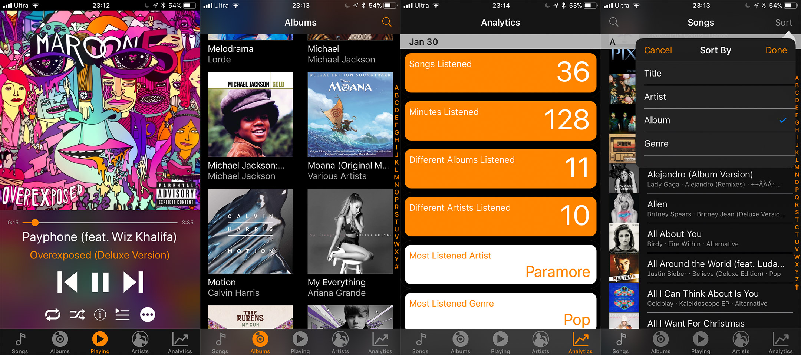

    

# iOS Music Analytics
A music client for iOS written in swift, aimed to provide user analytics information about their music library

### This app will be published to the app store soon! :+1::+1::+1::+1:

## Contents

This app functions both as a music player of music stored on local device, and an analyitics information viewer:
* Music Player:
    * View and search functionality of songs & albums
    * Generic functionality such as play, skip, shuffle and repeat
    * Ability to show detailed metadata (e.g. date released, play count)
    * **Ability to add lyrics to a song. (Lyrics are stored in a Core Data database)**
* Analytics
    *  For a single day:
        * Number of songs listened, minutes listened, etc
        * Most listened artist and genre
    * Overall:
        * Most listened songs, most skipped songs, longest songs, and much much more
    

### Thanks for stopping by! :)
